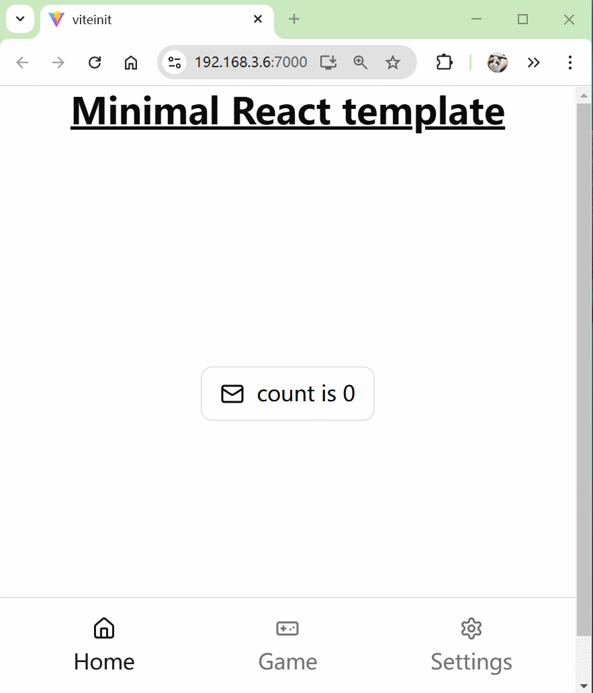

# Minimal React template

A minimal Front-end project template that has contained the following technology stack:

- React18
- TypeScript
- Vite
- pnpm
- tailwindcss4.0
- shadcn-ui
- PWA
- https

First Page is a bottom-navigation bar.

# Demo

# Installation Requirements
Nodejs + tailwindcss4.0 + shadcn-ui

# How To Use
1.git clone --depth 1 https://github.com/Knowckx/viteinit.git yourAppName

2.delete .git folder

3.pnpm install

# Command
## run in dev

pnpm dev

## Build and run (Https+PWA support)

pnpm run build

pnpm preview --host
